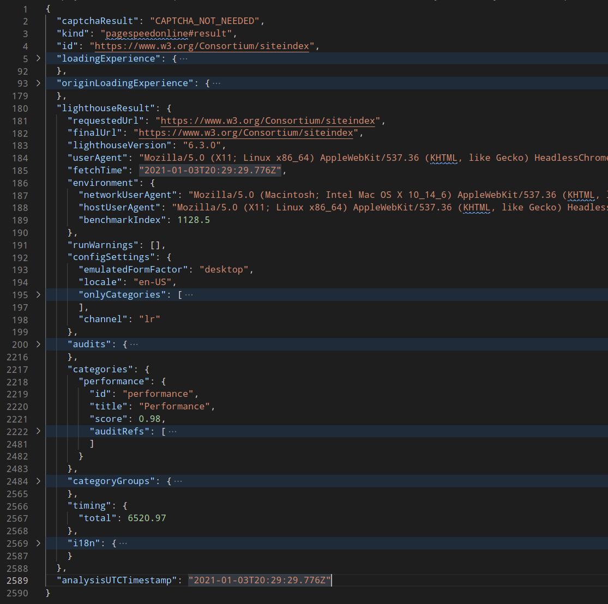

# How To Create a Perfception Project and Collect the Reports

## Outcome

A project directory is prepared and the first run is executed. First reports are
available for examination in the JSON format.

## Prerequisites

- [Perfception is installed](install-perfception.md)
- Understanding of command line usage. For example bash.

## Steps

### 1. Create a Project Directory

Create a new directory called `w3`, for example, with two directories inside
called `conf` and `logs`.

```
mkdir w3 && cd "$_" 
mkdir conf logs
```

### 2. Create a Queries Config

Create a new file inside the `conf` directory called `queries.js` with the following content:

```
module.exports = {
	baseUrl: "https://www.w3.org",
	queries: [
		{
			request: {
				url: "/",
			},
		},
		{
			request: {
				url:
					"/WAI/",
			},
		},
		{
			request: {
				url:
					"/Security/",
			},
		},
        {
			request: {
				url:
					"/Consortium/siteindex",
			},
		}
    ],
};
```

`baseUrl` may not include a trailing slash.

This configuration file is using the base URL `https://www.w3.org` as a prefix
for all queries. Please note the absence of the trailing slash. Four queries are
configured, therefore perfception will execute four audits and store the
corresponding JSON reports in the project directory.

### 3. Trigger the Audit and Collect the Reports

Switch to the project directory (`w3` in this example) and execute the following command:

`perfception collect`

Make sure that perfception is properly [installed](install-perfception.md) before running this command.

After starting the command the current logs will be streamed to STDOUT in
[NDJSON](http://ndjson.org/) format. See
[Log Output](../reference/log-output.md) to discover useful commands for working
with the log output.

### 4. Examine the Reports

If the run was successful, you will see a new directory called `entities` inside
the project directory. Here is an example of a report hierarchy. All folder and
file names will be different in your case, because they are called according to
the date and time when the report was started.

```
.
├── conf
│   └── queries.js
├── entities
│   ├── report
│   │   └── 2021
│   │       └── 0103
│   │           ├── 2007
│   │           │   └── 1609704479-27f80e066a4665ab.json
│   │           └── 2008
│   │               ├── 1609704482-7d580c0cf75f98c8.json
│   │               ├── 1609704485-363a58d62f930151.json
│   │               └── 1609704488-cd47fcad7196125a.json
│   └── run
│       └── 2021
│           └── 0103
│               └── 2007
│                   └── 1609704479-ccb4fd4b167285cf.json
└── logs
```

The files in the deepest directory of `report` will contain a complete response
from the PageSpeed Insights API. The file might contain up to 3000 lines. An
abridged example might look as follows:

